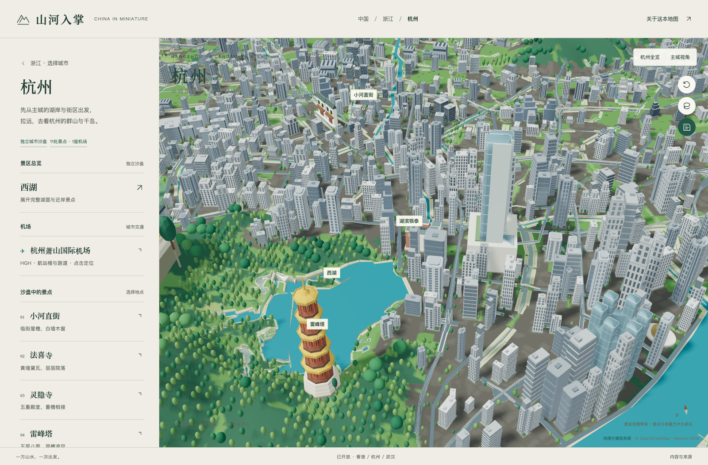

# City Miniature Atlas

An interactive Three.js city diorama built from geographic data. Includes a Hangzhou reference scene, reusable building and vegetation assets, and a working starter for bringing your own city boundary.

[中文](../README.md) · [Add a city](add-a-city.md) · [City Kit](../assets/city-kit/README.md) · [Architecture](architecture.md)



## Run

Node.js 18+ and a desktop browser with WebGL 2 are required.

```sh
git clone https://github.com/zhengjiazhi929-commits/city-miniature-atlas.git
cd city-miniature-atlas
npm start
```

Open http://127.0.0.1:4173/#/city/hangzhou . Runtime libraries, fonts and Hangzhou assets are bundled. No install step, API key or paid service is needed to launch. The generic city/province viewer and starter load online DEM/vector data and require network access.

The city starter is at `/examples/city-starter/`; the reusable asset gallery is at `/docs/city-kit.html`.

## Reuse

The generic viewer handles a bounded region, terrain, vector data, orbit controls, markers and resource disposal. City Kit provides fixed building, tree, road and bridge components. Geographic inputs remain city-specific: preserve real boundaries, water connectivity, roads and landmark positions.

The starter does **not** automatically reproduce Hangzhou's detailed composition. Hangzhou has dedicated land-use processing, display parameters, skyline models and precompiled geometry. Read [the integration guide](add-a-city.md) for the basic-map path and the detailed-diorama path. Unknown source coverage or missing building heights must not be presented as surveyed facts.

## Checks

```sh
npm run check
npm run check:city-assets
npm run check:city-starter
```

See [the build tools](../scripts/README.md) for optional dependencies and required raw archives. Source-changing rebuilds must also refresh the matching city cache.

## License

Original code and reusable assets: MIT. Geographic data, third-party libraries and fonts retain their own licenses. See [NOTICE.md](../NOTICE.md), [LICENSE](../LICENSE) and the notices alongside each dataset. Reference photographs and restricted airport charts are not distributed.
